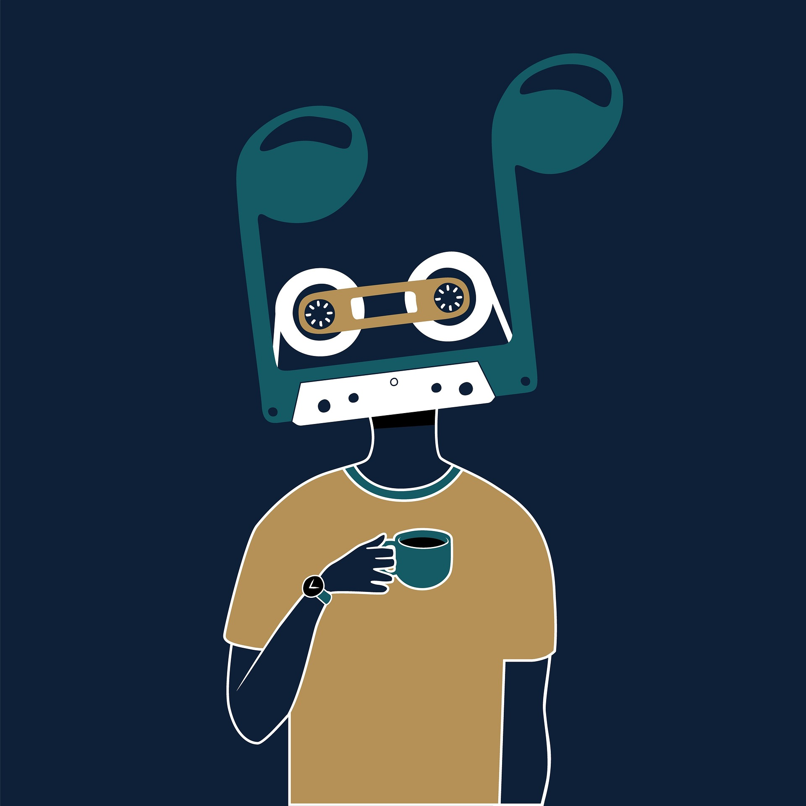
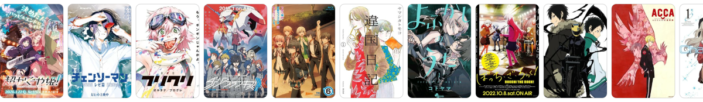
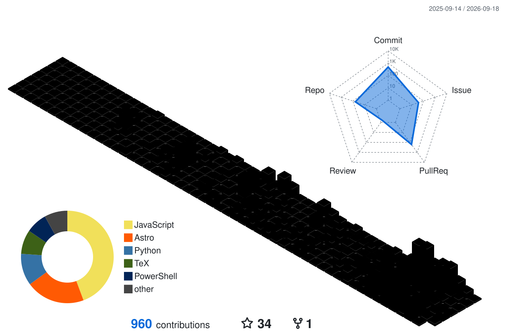

<h3 align="center">
  
</h3>

## An open-source youth engineer empowered by AI

Currently focused on robotics vision, AI agents, and large-model fine-tuning.

### Tech Stack

  
  
  
  
  
  
  
  
  

  
  
  
  
  
  
  
  
  
  
  
  
  
  

### Stack Collage

  

## A new-generation specialty coffee barista

Specializing in pour-over, espresso, and experimental coffee development.

Some of my personal favorites include The Great Navigator from Peet's, Three Africas from Blue Bottle, Bomb Bomb from Rarakiddo, and Mini Guava from Captain George. Each of these beans offers something unique - whether it's bright fruit notes, layered sweetness, or a clean and expressive finish.

Exploring different roasters and origins is one of the ways I continue to deepen my understanding of coffee and refine my brewing style.
 

## An original wood carving artist rooted in raw expression

Dedicated to embedding tension and dynamic lines into every unique piece of wood &rarr;  
[My Works](https://www.xiaohongshu.com/user/profile/6162a274000000000201d871)

## A jazz guitarist who lives by jazz as a personal creed

Passionate about creating free and unrestrained musical phrases.

## An anime lover.

## A stream-of-consciousness game developer in love with words

Want to know more?  
[Aliouswe's Nonsense](https://aliouswe.com/)

## GitHub Activity Graph

  <picture>
    <source media="(prefers-color-scheme: dark)" srcset="https://github-readme-activity-graph.vercel.app/graph?username=alectimison-maker&theme=github-dark" />
    <source media="(prefers-color-scheme: light)" srcset="https://github-readme-activity-graph.vercel.app/graph?username=alectimison-maker&theme=github-light" />
    
  </picture>

## GitHub 3D Contributions

